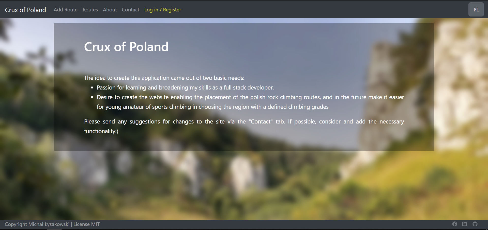
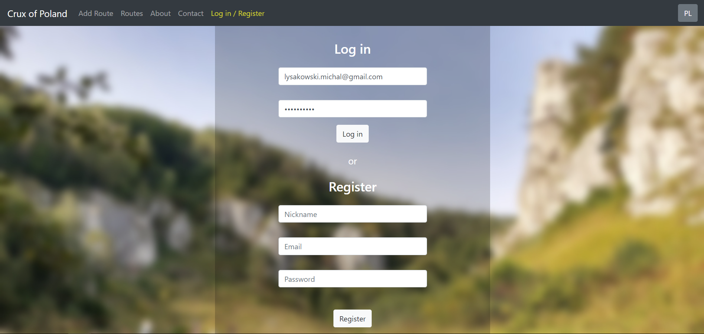
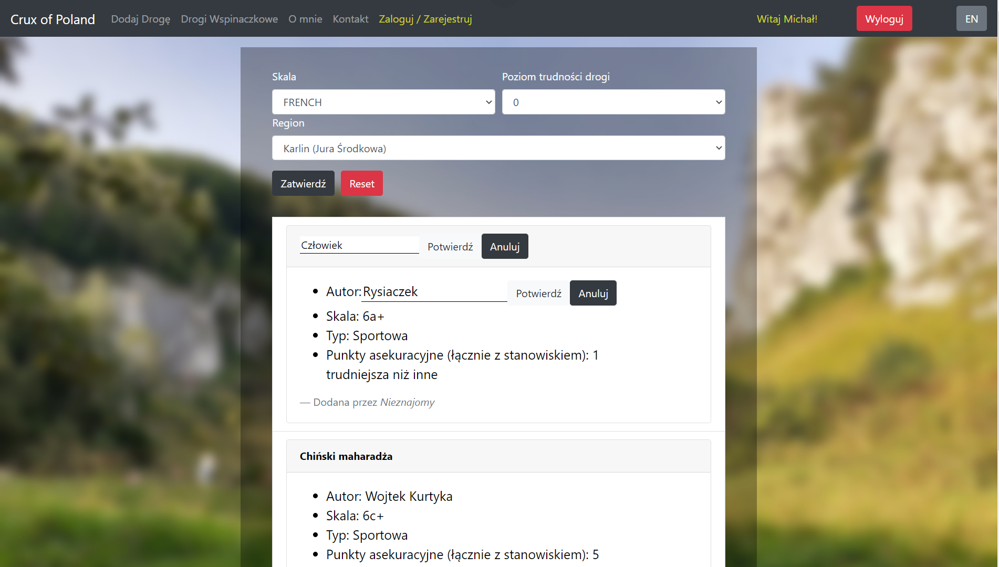
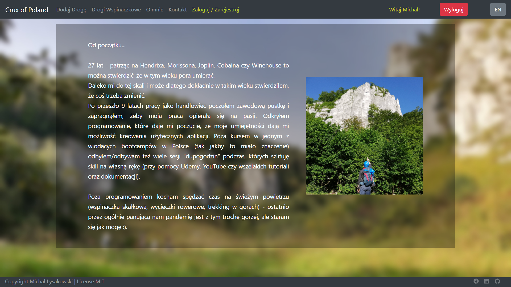

## PROJECT DESCRIPTION

This project was bootstrapped with [Create React App](https://github.com/facebook/create-react-app).

### Purpose
Crux of Poland app enables to the recording and organization of polish climbing routes by the members of comunity.

### Features

- creating user
- login user
- creating routes
- managing state with context api
- deleting routes by admin/moderator
- some of updating routes by moderators

in progress...
- rest of updating routes by moderators,
- admin panel to: give "moderator" type for ordinary user, deleting/deactivating users
- at home_page: google maps view to see all climbing regions 
- contact send mails
- design for god sake

### Packages I have chosen:
* Axios
* Bootstrap
* i18next
* Sass
* React Router
* ContextApi
* React-HTML-Parser

## Requirements

Node.js v 12.16.1 or higher

## How to run?

### Steps
1. `git clone https://github.com/lysakowski-art/crux_client.git`

2. `cd crux_client`

3. `npm i`

4. `npm start`
**IMPORTANT!**
* **Have to run on  127.0.0.1:3000**
* To log in as Admin use this login data: {email: "super_admin@mail.com", password: "password"}
* if you click on "submit" in "Climbing Routes" tab you will get all routes
* doubleclick on item in view route item to change content(title, author or description rest is in progress :) )

## Screens

## License 

[MIT](https://opensource.org/licenses/MIT)
